0.0.1-rc-0.0.10
Minimal mode added
BMI. BMR Barometer reading visibitly can be changed
Heart Rate Zone visibility can be toggled

0.0.1-rc-0.0.9
12/24hr support  available, toggle added to settings

0.0.1-rc-0.0.8
The Battery is a bar at the top, changes colour for every 25% increment/decrement.

The activity bars have current and target activity for steps, distance, elevation, calories active minutes.

The heart rate has active and resting hear rate with heart rate zone at the top.

The basal metabolic rate and BMI is displayed under heart rate

Date is day ,date month and year  at the bottom

Time is 12/24hrs with seconds.

Barometer reading from the sensor added for display in kPa

The clock face is a customised version built on the work available from `anha1` on Github for Acid Clock Face (https://github.com/anha1/fitbit-acidclock).

#Screenshots

##ionic
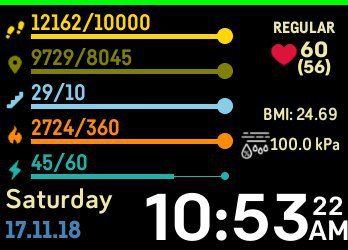
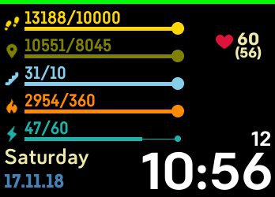
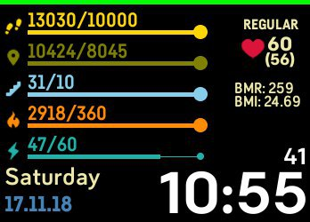
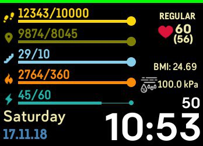
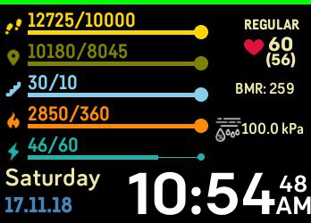
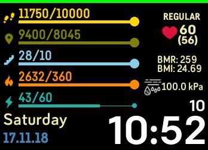
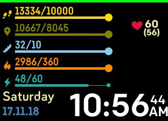
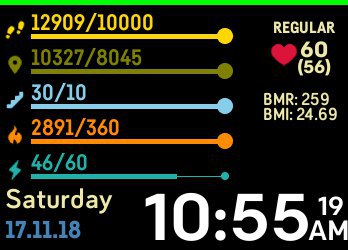
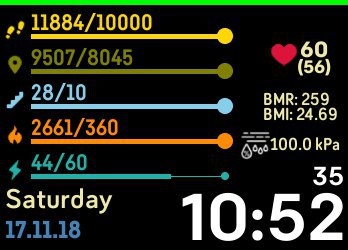
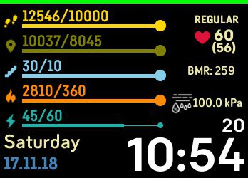
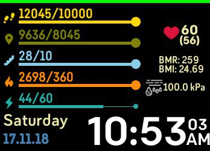
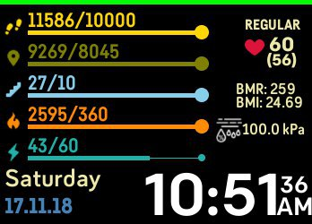

##versa
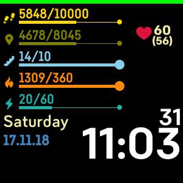
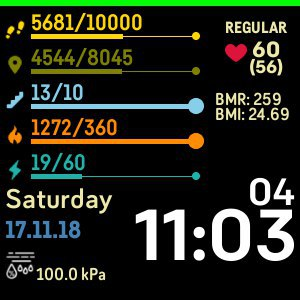
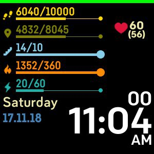
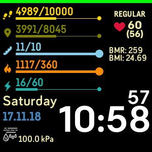
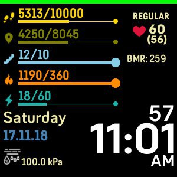
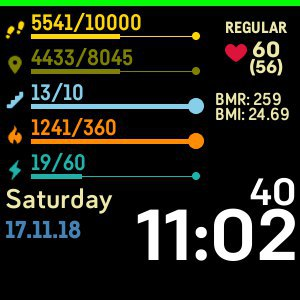
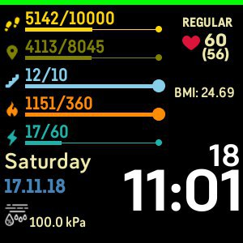
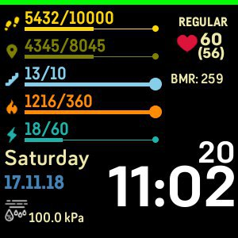
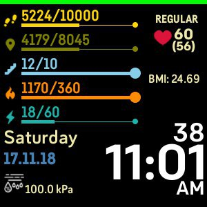
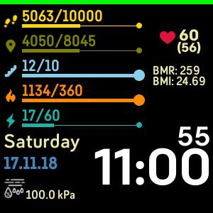
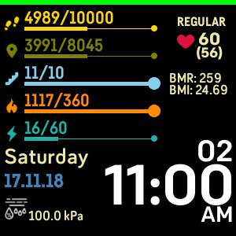
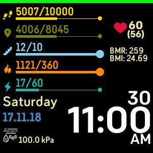
