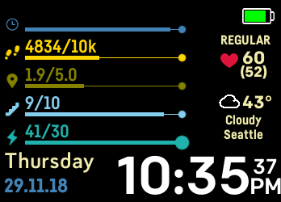

# Progression v1

`Fitbit` clockface for `ionic`
(https://gam.fitbit.com/gallery/clock/69e06b8c-8c82-47ee-aeff-a1c107ce8ac1)

The clock face is a customised version built on the work available from `ahsandar` on Github for AND v1 (https://github.com/anha1/fitbit-acidclock).  Which is a customised version built on the work available from `anha1` on Github for Acid Clock Face (https://github.com/anha1/fitbit-acidclock).

# Screenshots

## ionic
 

 
